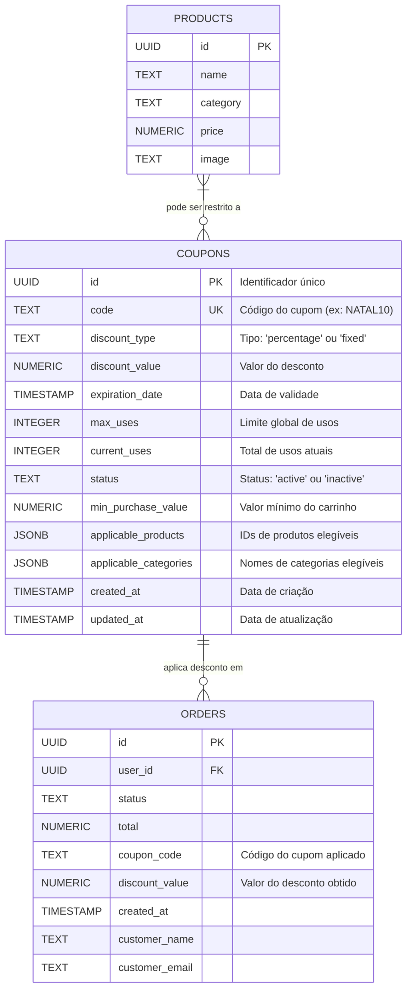

# Diagrama Entidade-Relacionamento (ER) - Sistema de Cupons

## Descrição das Tabelas

### `coupons`
Armazena as regras e definições dos cupons de desconto.
- **code**: Código único, case-insensitive.
- **discount_type**: Define se o desconto é percentual (`percentage`) ou valor fixo (`fixed`).
- **applicable_products/categories**: Arrays JSON para restringir o cupom a itens específicos.

### `orders`
Tabela de pedidos, agora incluindo campos para rastrear o uso de cupons.
- **coupon_code**: Armazena qual cupom foi usado no pedido.
- **discount_value**: O valor monetário total descontado do pedido.
